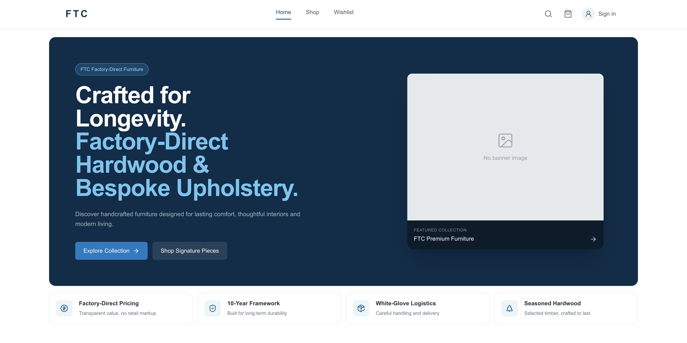
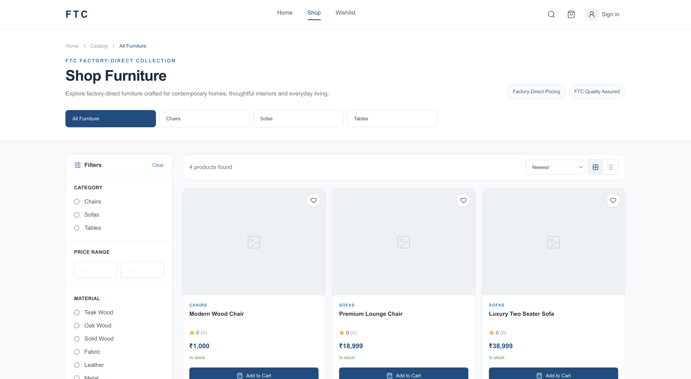
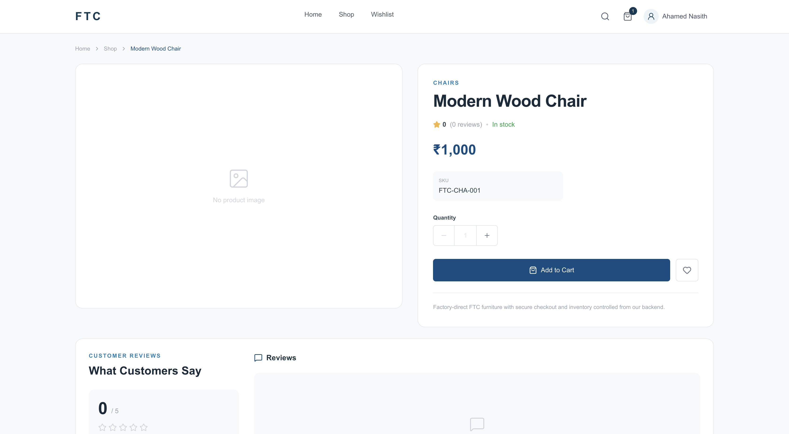
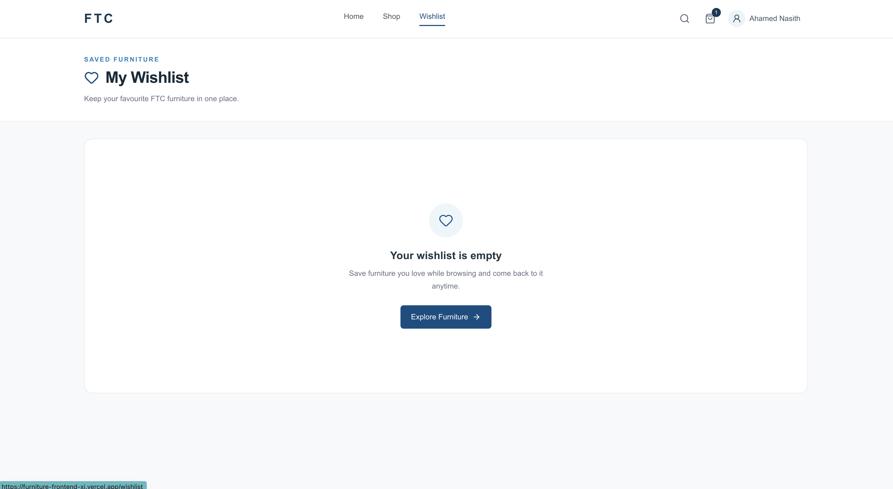

# FTC Furniture — Full-Stack E-Commerce Platform

FTC Furniture is a full-stack premium furniture e-commerce application built as a portfolio project to demonstrate real-world frontend development, backend API development, authentication, e-commerce workflows, and admin dashboard functionality.

The platform consists of two connected applications:

- Customer-facing furniture e-commerce website
- Admin dashboard for managing the store

## Live Demo

Customer Website:
https://furniture-frontend-xi.vercel.app

Backend API:
https://furniture-backend-mu.vercel.app/api/v1

## Tech Stack

### Frontend

- Next.js
- JavaScript
- Tailwind CSS
- Zustand
- Axios
- Framer Motion
- Recharts
- Lucide React

### Backend

- Node.js
- Express.js
- Sequelize ORM
- MySQL-compatible TiDB Cloud
- JWT Authentication
- bcrypt

### Deployment

- Frontend — Vercel
- Backend — Vercel
- Database — TiDB Cloud

## Key Features

### Customer Storefront

- User registration, login and JWT-based authentication
- Responsive furniture catalog with categories, search and filtering
- Product detail pages with pricing, stock, specifications and related products
- Wishlist and persistent shopping cart
- Address management for customer accounts
- Checkout flow with order creation and stock validation
- Customer order history, order details and cancellation
- Product ratings and reviews
- Account profile and password management

### Admin Dashboard

- Business overview dashboard with revenue, orders, customers and product metrics
- Product creation, editing and inventory management
- Category and catalog management
- Order management with order and payment status updates
- Customer list and customer detail views
- Low-stock inventory monitoring
- Sales and business analytics
- Store configuration and settings

### Backend & Data

- REST API built with Node.js and Express.js
- Sequelize ORM with MySQL-compatible TiDB Cloud
- Role-based authentication for customers and administrators
- Server-side product pricing and stock validation
- Order and address snapshots for historical order accuracy
- Protected customer and admin API routes
- Production database hosted on TiDB Cloud

## Screenshots

### Home Page



### Shop



### Product Details



### Wishlist Details



### Admin Dashboard


## Project Architecture

FTC Furniture is split into two connected applications:

```text
Customer / Admin Frontend
        │
        │  Axios REST requests
        ▼
Next.js Application
        │
        ▼
Node.js + Express REST API
        │
        ▼
Sequelize ORM
        │
        ▼
TiDB Cloud
(MySQL-compatible database)